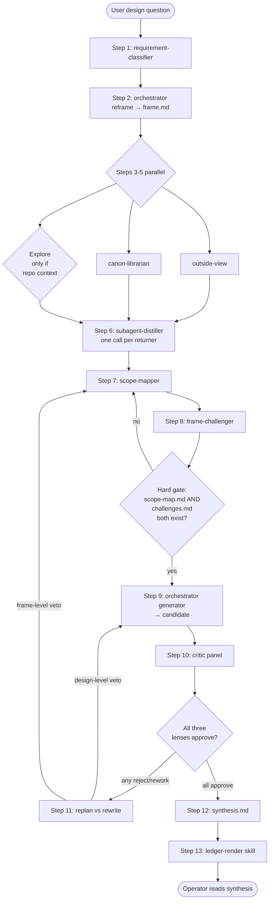
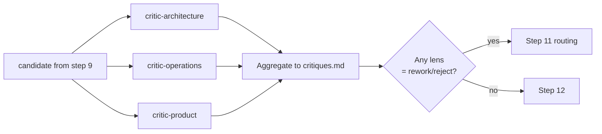
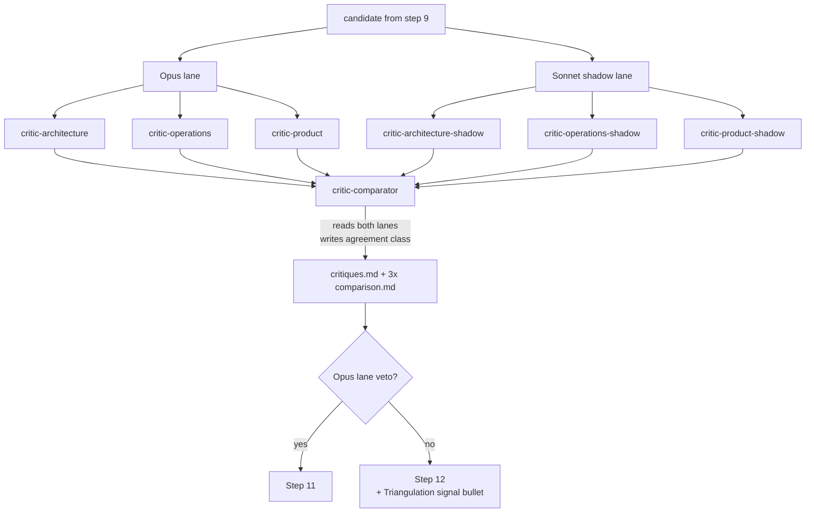

# .claude/agents/

The 14 agents that drive the 13-step adversarial-review workflow. The orchestrator (root Claude session) invokes them via the `Agent` tool.

**Read this when:** you need to know which agent does what, when each runs, what tools each has, or how the critic panel composes (including shadow lanes). **Skip if:** you only need to know *how to run a workflow* — that's [CLAUDE.md](CLAUDE.md).

## Inventory

| Agent | Role | Step | Tools | Model |
|---|---|---|---|---|
| [requirement-classifier](.claude/agents/requirement-classifier.md) | Labels question as new / replace / extend / migrate / refactor / investigation; states default frame bias | 1 | Read | inherits |
| [outside-view](.claude/agents/outside-view.md) | Reference-class forecast; canon-first, then WebSearch only for currency or gaps | 3–5 | WebSearch, WebFetch, Read | inherits |
| [canon-librarian](.claude/agents/canon-librarian.md) | Retrieves passages from `canon/corpus/`; routes `live-only` entries to WebFetch; flags stale snapshots; **required to return at least one contradicting passage** | 3–5 | Read, Bash, Glob, Grep, WebFetch | inherits |
| [subagent-distiller](.claude/agents/subagent-distiller.md) | Compresses subagent returns to ≤2k-token structured distillations; runs once per subagent | 6 | Read, Write | inherits |
| [scope-mapper](.claude/agents/scope-mapper.md) | Maps requirement against existing primitives; labels subsume / replace / extend / conflict; preservation needs reason | 7 | Read, Write, Grep, Glob | inherits |
| [frame-challenger](.claude/agents/frame-challenger.md) | Devil's advocate on the frame (not the candidate); names alternative frame + condition where current frame is wrong | 8 | Read, Write | inherits |
| [critic-architecture](.claude/agents/critic-architecture.md) | Structural lens: invariants, coupling, module boundaries, aggregate design, dependency direction | 10 | Read, WebFetch, WebSearch | inherits |
| [critic-operations](.claude/agents/critic-operations.md) | Operational lens: SLOs, error budget, on-call load, blast radius, rollout/rollback, observability, cost | 10 | Read, WebFetch, WebSearch | inherits |
| [critic-product](.claude/agents/critic-product.md) | Product-surface lens: user-visible contract changes, customer commitments, migration burden, day-1 UX | 10 | Read, WebFetch, WebSearch | inherits |

### Shadow lane (only under `SHADOW_PANEL=1`)

| Agent | Role | Writes to | Model |
|---|---|---|---|
| [critic-architecture-shadow](.claude/agents/critic-architecture-shadow.md) | Sonnet-pinned shadow of architecture lens | `critiques/architecture.shadow.md` | sonnet (pinned) |
| [critic-operations-shadow](.claude/agents/critic-operations-shadow.md) | Sonnet-pinned shadow of operations lens | `critiques/operations.shadow.md` | sonnet (pinned) |
| [critic-product-shadow](.claude/agents/critic-product-shadow.md) | Sonnet-pinned shadow of product lens | `critiques/product.shadow.md` | sonnet (pinned) |
| [critic-comparator](.claude/agents/critic-comparator.md) | Triangulation meta-lens; reads both lanes; emits per-lens `agreement_class` (agree / partial-agree / disagree / unavailable) | `critiques/<lens>.comparison.md` | inherits |

**Shadow rule: voice, not vote.** Opus lane retains verdict authority. Disagreement surfaces in step 12 synthesis as a "Triangulation signal" bullet — never as a verdict change.

### Manual / scheduled (outside the 13-step flow)

| Agent | Role | When |
|---|---|---|
| [canon-refresher](.claude/agents/canon-refresher.md) | Proposes new corpus entries from RSS feeds; never writes to corpus; emits paste-ready `sources.yaml` blocks | Manual, or via `claude.ai/code` Routines (weekly) |

---

## Workflow flow (steps 1-13)

Step 2 (reframe), Step 9 (generator), Step 11 (replan/rewrite decision), and Step 12 (synthesis) are **orchestrator work** — no dedicated agent. The hard gate after Step 8 is non-negotiable.

---

## Critic panel detail (Step 10)

### Default mode (3 lenses, parallel)

**Minority-veto rule**: any single lens returning `rework` or `reject` triggers Step 11. Majority-approve does not override a single-lens veto. Each lens must produce at least one frame-level objection in addition to its lens-specific critique.

### Shadow mode (`SHADOW_PANEL=1` — 6 lenses + comparator)

**Critical:** Opus lane retains verdict authority. The comparator does NOT vote on the candidate — it only reports whether the two lanes agreed (`agree | partial-agree | disagree | unavailable`). The shadow has voice, not vote.

When to enable `SHADOW_PANEL=1`: high-stakes decisions where the cost of *correlated review error* (one model family's blindspot) exceeds the doubled per-lens spend. Default is off.

A second env var `EXTERNAL_SHADOW=1` is *reserved* for cross-family shadowing (OpenRouter / local Ollama) — currently inert; see [garden/heirloom/2026-04-26-critic-panel-correlated-by-default/](garden/heirloom/2026-04-26-critic-panel-correlated-by-default/) for deferred work.

---

## Output contracts (what each agent writes)

| Agent | Artifact | Location |
|---|---|---|
| `requirement-classifier` | `requirement.md` (<600 tokens) | session root |
| `outside-view` | (returns text — orchestrator distills) | — |
| `canon-librarian` | (returns text — orchestrator distills) | — |
| `subagent-distiller` | `<source-agent>.md` (≤2k tokens) | `distillations/` |
| `scope-mapper` | `scope-map.md` | session root |
| `frame-challenger` | `challenges.md` | session root |
| `critic-architecture` | `architecture.md` (OR `critiques.md` in default mode) | `critiques/` |
| `critic-operations` | `operations.md` (OR `critiques.md` in default mode) | `critiques/` |
| `critic-product` | `product.md` (OR `critiques.md` in default mode) | `critiques/` |
| `critic-*-shadow` | `<lens>.shadow.md` | `critiques/` |
| `critic-comparator` | `<lens>.comparison.md` (one per lens) | `critiques/` |
| `canon-refresher` | Review blocks to stdout (curator pastes manually) | — |

**Disk locations are repo-relative paths under `.claude/session-artifacts/<session-id>/`**.

---

## Invocation conventions

1. **One Agent call per agent invocation.** When invoking multiple agents in parallel (steps 3-5, step 10), send all `Agent` tool calls in a single message.
2. **The orchestrator never reads raw subagent output after step 6.** Raw returns live on disk for audit; the orchestrator reads only `distillations/<agent>.md`. This is the anti-anchoring contract.
3. **Hard gate before step 9.** If `scope-map.md` or `challenges.md` does not exist, the orchestrator must re-run the missing step before generating. Non-negotiable.
4. **Verdict files are load-bearing.** A lens that returns text without persisting `<lens>.md` to disk is a defect. Each critic lens has Write authority for exactly that purpose.

---

## Conventions specific to this folder

These rules apply to agent files (`.claude/agents/*.md`) and do not appear in root [CLAUDE.md](CLAUDE.md):

- **Frontmatter `description` field must answer what + when**, per [Anthropic skill best-practices](https://platform.claude.com/docs/en/agents-and-tools/agent-skills/best-practices). Use the form: *"Reviews X through the Y lens. Returns Z verdict + W. Runs at step N. Has authority to reject."*
- **Tools field is load-bearing**: omitting it inherits all tools, which violates the principle of least privilege. Every agent declares its exact tool list.
- **Shadow agents have `model: sonnet` pinned** in frontmatter. Opus lenses inherit (orchestrator default) — see Phase 5 of the AI-docs rollout for the proposal to pin them explicitly.
- **Considered-and-declined R&D candidates** may be parked as HTML comments at the top of an agent file (see `canon-librarian.md` / `canon-refresher.md` for examples). The format is: `<!-- Considered-and-declined in session <id>: <finding-id>. <one-sentence rationale>. -->`. The agent's runtime behavior is unchanged; these comments are audit trail.

---

## Maintenance

### Add a new agent

1. Decide whether it belongs in the 13-step workflow or as manual/scheduled. If workflow, identify the step.
2. Create `.claude/agents/<kebab-name>.md` with valid frontmatter (name, description, tools; model if pinned).
3. Add a row to the appropriate inventory table above.
4. If the agent is invoked at a specific step, update [CLAUDE.md](CLAUDE.md) to reference it.
5. Update the mermaid diagrams above if the agent participates in the workflow flow or critic panel.

### Edit an existing agent

1. Edit the agent file.
2. If the `description` field changes meaningfully (what/when changes), update the inventory row.
3. If the tool list changes, update the Tools column.
4. If invocation contract changes (e.g., output location), update the Output contracts table.

### Retire an agent

1. Decide: delete vs. mark deprecated.
   - **Delete** if the agent is genuinely wrong or superseded by another.
   - **Mark deprecated** by adding `**DEPRECATED:** <reason and date>` at the top of the agent file body if there's audit value in keeping it visible.
2. Remove the inventory row (or move to a "Deprecated" section).
3. Remove from any mermaid diagrams.
4. Remove from CLAUDE.md if cited there.
5. Search for invocations: `grep -rn 'subagent_type.*<agent-name>'` and update or remove them.

### Schema changes (the bloat-prevention rule)

Adding a new frontmatter field across all agents is a schema change. Per the [Operating principle](.claude/agents/README.md#operating-principle--ratchet-forward-never-sideways):
1. Justify the field — what does it capture that no existing field captures?
2. Update every agent in the same commit. No half-measures.
3. Document the field in this README's "Conventions" section.

---

## See also

- [CLAUDE.md](CLAUDE.md) — root operating manual; defines workflow trigger conditions and bypass rules
- [.claude/skills/README.md](.claude/skills/README.md) — companion inventory for the 6 skills
- [.claude/hooks/README.md](.claude/hooks/README.md) — diagnostics pipeline (collects per-agent token usage)
- [.claude/session-artifacts/README.md](.claude/session-artifacts/README.md) — artifact schema and ledger spec
- [research/sota-2026-v2/16-ai-readable-docs.md](research/sota-2026-v2/16-ai-readable-docs.md) — SOTA reference for AI-doc authoring (the basis for this README's structure)
