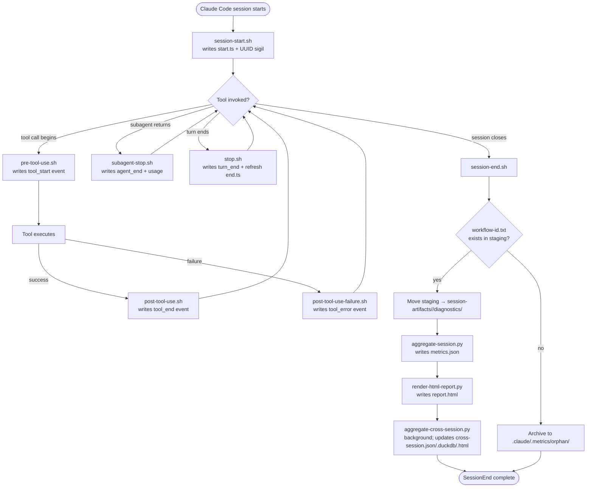
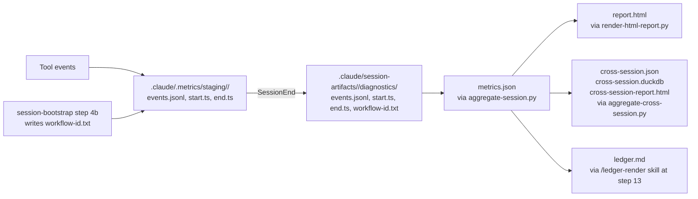

# .claude/hooks/

The 7 Claude Code hook scripts that capture diagnostics for every session. Hooks fire automatically on Claude Code lifecycle events; they are **AI-blind** by design (stdout/stderr suppressed, the workflow never sees them).

**Read this when:** you're editing a hook, debugging why diagnostics aren't appearing, or need to understand the diagnostics-binding contract that CLAUDE.md depends on. **Skip if:** you only need to read the captured data — that lives in `.claude/session-artifacts/<session-id>/diagnostics/` per session.

## Inventory

| Hook file | Event | Fires | Writes |
|---|---|---|---|
| [session-start.sh](.claude/hooks/session-start.sh) | `SessionStart` | Once at session start | `start.ts`, `current-session-uuid` sigil, `session_start` event |
| [pre-tool-use.sh](.claude/hooks/pre-tool-use.sh) | `PreToolUse` | Before every tool call | `tool_start` event with `gen_ai.tool.name`, `gen_ai.tool.call.id`, ns-precision timestamp |
| [post-tool-use.sh](.claude/hooks/post-tool-use.sh) | `PostToolUse` | After every successful tool call | `tool_end` event with `tool.status: ok` |
| [post-tool-use-failure.sh](.claude/hooks/post-tool-use-failure.sh) | `PostToolUseFailure` | After every failed tool call | `tool_error` event with sanitized `error.type` + `error.message` (first 200 chars) |
| [subagent-stop.sh](.claude/hooks/subagent-stop.sh) | `SubagentStop` | After every Agent invocation returns | `agent_end` event with `gen_ai.usage.*` (input/output/cache tokens), duration, tool count |
| [stop.sh](.claude/hooks/stop.sh) | `Stop` | After every turn (per response) | `turn_end` event; refreshes `end.ts` (fallback if SessionEnd never fires) |
| [session-end.sh](.claude/hooks/session-end.sh) | `SessionEnd` | Once at session close | Aggregates staging → diagnostics dir; runs parser; renders HTML report; triggers cross-session aggregation |

All 7 hooks are wired in [.claude/settings.json](.claude/settings.json) under `"hooks"`.

---

## Hook execution flow



---

## Data flow (where events land, then where they go)



**The binding contract:** the Claude session UUID (assigned by Claude Code) and the workflow-id (assigned by the orchestrator at step 1) must be bound, or `SessionEnd` cannot route the events into the right session dir. The binding mechanism is `workflow-id.txt` in the staging directory — written by the [`session-bootstrap` skill](.claude/skills/session-bootstrap/SKILL.md) at step 4b. **If binding is skipped, events archive to `.claude/.metrics/orphan/` and the ledger must hand-tally.**

---

## Event schema (OpenTelemetry GenAI-aligned)

Every event in `events.jsonl` is one JSON object per line, with these common fields:

| Field | Type | Purpose |
|---|---|---|
| `ts_ns` | integer | Nanosecond-precision Unix timestamp |
| `event` | string | Event type: `session_start \| tool_start \| tool_end \| tool_error \| agent_end \| turn_end` |

Event-specific fields (OpenTelemetry GenAI semantic conventions):

| Event | Additional fields |
|---|---|
| `session_start` | `session_id` |
| `tool_start` | `gen_ai.tool.name`, `gen_ai.tool.call.id` |
| `tool_end` | `gen_ai.tool.name`, `gen_ai.tool.call.id`, `tool.status` (always `ok` here) |
| `tool_error` | `gen_ai.tool.name`, `gen_ai.tool.call.id`, `_err: {error.type, error.message}` |
| `agent_end` | `gen_ai.usage.input_tokens`, `gen_ai.usage.output_tokens`, `gen_ai.usage.cache_read.input_tokens`, `gen_ai.usage.cache_creation.input_tokens`, `duration_ms`, `tool_uses_count`, `agent_id`, `agent_type` |
| `turn_end` | (no extra fields) |

The OTel alignment is intentional — when a real telemetry backend is added later, the schema is already conformant.

---

## The AI-blind contract (load-bearing)

Hooks **MUST NOT** emit anything visible to the AI:
- `set +e` (failures don't crash the session)
- All `2>/dev/null` and `>/dev/null` suppress output
- `exit 0` unconditionally — no error codes propagate
- No `Write` events that the orchestrator would parse

**Why:** if a hook printed something the AI saw, the diagnostics pipeline would become part of the workflow's input — anti-anchoring would break. Hooks are observability, not behavior.

---

## Failure modes (and why hooks tolerate them)

Each hook starts with `set +e` and pipes all errors to `/dev/null`. This is deliberate:

| Failure | What happens | Why it's OK |
|---|---|---|
| `jq` not installed | All field extractions return empty strings | Hook still writes event with `"unknown"` fields; parser handles missing values |
| `date +%s%N` returns literal "N" (BSD date) | Fallback to `$(date +%s) * 1000000000` | Detected via `case "$TS_NS" in *N)`; second-precision is good enough |
| Staging dir doesn't exist | `mkdir -p` creates it | Idempotent |
| `events.jsonl` not writable | Event silently dropped | Better than crashing the user's session |
| `workflow-id.txt` not present at SessionEnd | Events archive to `.claude/.metrics/orphan/<UUID>/` | No loss; visible in audit; ledger falls back to hand-tally |
| Parser missing | `[ -x ... ]` check skips it | HTML report still missing — visible as "no report.html" in session dir |

**Anti-pattern**: removing `2>/dev/null` to "debug" a hook. Better: tail the staging events.jsonl in a separate terminal, or temporarily redirect to a known log file.

---

## Conventions specific to this folder

These rules apply to hook scripts and do not appear in root [CLAUDE.md](CLAUDE.md):

- **All hooks are bash, not Python or Node.** Bash has zero install cost on macOS/Linux; Python startup latency (~50ms) per tool call would add up across thousands of tool calls per session.
- **Use `jq` for JSON parsing.** Inline regex parsing of the payload is error-prone; `jq` is the standard tool. If `jq` is unavailable, hooks degrade gracefully (fields become `"unknown"`).
- **Use `printf` for emitting JSON events**, not `echo` — `echo` interpretation of backslashes varies between shells.
- **All file paths use `$CLAUDE_PROJECT_DIR` with `$(pwd)` fallback.** Hooks may execute with arbitrary CWD; `$CLAUDE_PROJECT_DIR` is the canonical reference.
- **Nanosecond timestamps for tool events.** Tool calls can complete in <1ms; second precision loses pair-matching latency. Use `date +%s%N` with BSD fallback.
- **Heavy work runs in SessionEnd, not per-turn.** `stop.sh` is intentionally lightweight (one line of write). Per-Anthropic-hooks-guidance, aggregation should be once per session, not once per turn.

---

## The diagnostics binding contract (CRITICAL — load-bearing for ledger)

The orchestrator's job at step 1 is to bind the Claude session UUID to the workflow-id. The mechanism is:

1. `session-start.sh` writes `current-session-uuid` sigil to `.claude/.metrics/`.
2. The orchestrator (or [`session-bootstrap` skill](.claude/skills/session-bootstrap/SKILL.md) at step 4b) reads the sigil and writes:
   ```bash
   echo "<workflow-id>" > .claude/.metrics/staging/<UUID>/workflow-id.txt
   ```
3. `session-end.sh` reads `workflow-id.txt` and moves all staging events to `.claude/session-artifacts/<workflow-id>/diagnostics/`.

**If binding is skipped:**
- Events archive to `.claude/.metrics/orphan/<UUID>/` (no loss, no pollution)
- `diagnostics/metrics.json` is NOT produced for the session
- The [`/ledger-render` skill](.claude/skills/ledger-render/SKILL.md) falls back to hand-tally
- The ledger-render skill flags the missing binding as a workflow defect

This contract is also documented in [CLAUDE.md](CLAUDE.md) step 1. The binding step is non-optional for non-bypassed sessions.

---

## Maintenance

### Add a new event type

1. Identify the Claude Code event (see [Anthropic hooks docs](https://docs.claude.com/en/docs/claude-code/hooks) for the canonical list).
2. Create `<event-name>.sh` in this folder.
3. Follow the AI-blind contract (`set +e`, `2>/dev/null`, `exit 0`).
4. Wire it in [.claude/settings.json](.claude/settings.json) under `"hooks"`.
5. Append a row to the inventory table above.
6. If the event produces a new event type in `events.jsonl`, document it in the event schema table.
7. Update `bin/diagnostics/aggregate-session.py` to parse the new event type, if it carries useful data.

### Edit an existing hook

1. Edit the script. **Run `shellcheck` before saving** — silent failures are insidious.
2. Test by running a Claude Code session and inspecting `.claude/.metrics/staging/<UUID>/events.jsonl`.
3. If field semantics change, update the event schema table here AND `aggregate-session.py`.

### Retire a hook

1. Remove the file.
2. Remove the hook block from `.claude/settings.json`.
3. Remove inventory row.
4. If the hook's events appeared in `metrics.json`, the parser may produce zeros — that's fine; better than ghost data.

### Schema changes

The event schema is load-bearing for the parser and HTML renderer. To add a field:
1. Update one or more hooks to emit the field.
2. Update `bin/diagnostics/aggregate-session.py` to consume it.
3. Update `bin/diagnostics/render-html-report.py` if it should appear in the report.
4. Update the event schema table in this README.
5. No half-measures per the [Operating principle](.claude/hooks/README.md#operating-principle--ratchet-forward-never-sideways) — backfill nothing in old events.jsonl; the field is simply absent in old sessions.

---

## Anti-patterns

- **Removing `2>/dev/null` to debug a hook.** Better: write debug output to a separate file like `/tmp/hook-debug.log`.
- **Doing heavy work in per-turn hooks.** `stop.sh` fires per response — anything beyond a single event write is too much. Aggregate in SessionEnd.
- **Adding hooks that mutate the session-artifacts dir directly.** That's `session-end.sh`'s job. Per-event hooks write to staging only.
- **Using `bash -e`** in hooks. A single missing dependency would crash the user's session.
- **Writing diagnostics into stdout** thinking "it'll be useful for the AI." Hooks are AI-blind by design; if the AI needs information, the artifact is the surface, not the hook.
- **Hard-coding paths.** Use `$CLAUDE_PROJECT_DIR` with `$(pwd)` fallback.

---

## See also

- [Anthropic hooks documentation](https://docs.claude.com/en/docs/claude-code/hooks) — the canonical event list and payload schemas
- [.claude/settings.json](.claude/settings.json) — hook wiring
- [bin/diagnostics/](bin/diagnostics/) — the parser and HTML renderer (consumers of events.jsonl)
- [.claude/session-artifacts/README.md](.claude/session-artifacts/README.md) — destination schema for `diagnostics/metrics.json`
- [.claude/skills/session-bootstrap/SKILL.md](.claude/skills/session-bootstrap/SKILL.md) — the binding-contract enforcer at step 4b
- [.claude/skills/ledger-render/SKILL.md](.claude/skills/ledger-render/SKILL.md) — primary consumer of `metrics.json`
- [garden/heirloom/2026-05-17-diagnostics-as-first-class/](garden/heirloom/2026-05-17-diagnostics-as-first-class/) — R&D rationale for the diagnostics-as-first-class migration
