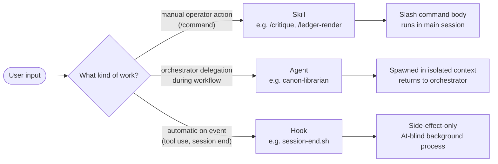

# .claude/skills/

The 7 skills available in `claude-critic-stack`. Skills are reusable behaviors the operator (or AI) triggers explicitly — typically via slash command.

**Read this when:** you want to know what a slash command does, what skills exist, when each should be invoked, or how skills differ from agents and hooks. **Skip if:** you need workflow-step semantics — those live in [CLAUDE.md](CLAUDE.md).

## Inventory

| Skill | Slash command | Trigger | Purpose | Allowed tools |
|---|---|---|---|---|
| [critique](.claude/skills/critique/SKILL.md) | `/critique <doc-path>` | **manual** | One-shot adversarial review of a design document. Mints a session, freezes the doc as `question.md` + `inputs.md`, runs the full 13-step workflow against it in the same chat. ~5-15 min. | Bash subset, Read, Write, Edit, AskUserQuestion |
| [session-bootstrap](.claude/skills/session-bootstrap/SKILL.md) | `/session-bootstrap <slug>` | **manual** | Mint a session-artifacts directory + question.md skeleton. Use when starting a workflow session by hand (rare; `/critique` is preferred when you have a doc). Also binds the workflow-id for the diagnostics pipeline. | Bash subset, Read, Write |
| [ledger-render](.claude/skills/ledger-render/SKILL.md) | `/ledger-render <session-id>` | **manual**, at step 13 | Compute and write `ledger.md` for a 13-step session. Derives counts from `diagnostics/metrics.json` (primary path) or hand-tallies as fallback. Updates `synthesis.md` final line with the Ledger citation. | Bash subset, Read, Write |
| [path-check](.claude/skills/path-check/SKILL.md) | `/path-check [<file-or-glob>]` | **manual** | Run path-discipline checks on markdown files. Detects absolute paths, `~/`-paths, broken links. Use before commits, after editing CLAUDE.md, or when the user asks to verify links. | `./bin/check-path-discipline.sh`, git, find, Read |
| [explain](.claude/skills/explain/SKILL.md) | `/explain` | **manual** | On-demand orientation card for the repo. Markdown output (always visible in chat). | `bin/explain-state.sh` |
| [explain-pretty](.claude/skills/explain-pretty/SKILL.md) | `/explain-pretty` | **manual** | Full ANSI terminal card with figlet header and tokyo-night palette. Folded by Claude Code unless `verbose: true` is set. Prefer `/explain` for normal use. | `bin/explain-card.sh` |
| [upgrade](.claude/skills/upgrade/SKILL.md) | `/upgrade <thought>` | **manual** | Capture a profound / novel / creative R&D idea into [garden/](garden/) — fast, formatted, filed. Decides category (volunteer / perennial / specimen / heirloom), generates meta + state tables, writes the entry. Migrated from `.claude/commands/upgrade.md` on 2026-05-17. | Bash subset, Read, Write |

All 7 skills are **manually triggered** — none auto-fire on any event. The auto-fire surface is hooks, not skills (see [.claude/hooks/README.md](.claude/hooks/README.md)).

---

## Skills vs agents vs hooks — when does each apply



| | Skill | Agent | Hook |
|---|---|---|---|
| Trigger | Slash command (`/...`) | `Agent` tool call by orchestrator | Claude Code event (SessionStart, PreToolUse, etc.) |
| Context | Main session | Isolated subagent context | None (shell process) |
| AI sees output? | Yes | Yes (orchestrator receives return) | No (AI-blind by design) |
| Persistence | Skill body in `.claude/skills/<name>/SKILL.md` | Agent prompt in `.claude/agents/<name>.md` | Shell script in `.claude/hooks/<event>.sh` |
| Tool budget | Declared in frontmatter `allowed-tools` | Declared in frontmatter `tools` | Whatever the shell can do |
| Use for | Operator-facing workflows | Specialized reasoning in isolated context | Diagnostics, observability, side effects |

---

## Triggering pattern (how slash commands map to skills)

When the user types `/<skill-name>` in the Claude Code prompt, the harness loads the corresponding `SKILL.md` and the body runs in the main session. The skill body is itself a prompt — typically with instructions like "do X, then write Y, then report Z."

**Slash commands in this repo correspond 1:1 with skills.** There is no separate `slash → agent` mapping (slash commands DO NOT trigger Agent invocations directly — though a skill may *internally* invoke agents via the Agent tool).

The [.claude/commands/](.claude/commands/) folder is **legacy** (per Anthropic: *"Custom commands have been merged into skills"*). Its single remaining file is a guard README; no live commands. New `/name` invocations are skills only. The historical distinction was:
- **Skills** (`.claude/skills/<name>/SKILL.md`): structured behaviors with frontmatter (name, description, allowed-tools, argument-hint). May span multiple files in the skill dir. **Forward-canonical form.**
- **Slash commands** (`.claude/commands/<name>.md`): lighter-weight; a single markdown file with frontmatter. **Deprecated** as a separate primitive; existing files still work for backward compat but skills get all new affordances.

---

## Frontmatter reference — all supported fields

Source of truth: [Claude Code skills docs](https://code.claude.com/docs/en/skills.md). Verified 2026-05-17 against the official reference. Unknown fields are silently ignored by the harness — adding `category:`, `version:`, or `tags:` does nothing.

### Fields currently used in this repo

| Field | Type | Effect |
|---|---|---|
| `name` | string | Display name. Defaults to the directory name if omitted. |
| `description` | string | One-line "what + when." Used by Claude to decide auto-invocation; surfaced in the `/`-menu. |
| `argument-hint` | string | Placeholder shown in the slash-command autocomplete. Mandatory for argument-taking skills. |
| `allowed-tools` | string | Tool allowlist for the skill's body — no permission prompt for these. Bash subset uses the form `Bash(<cmd>:*)`. |
| `model` | string | Override the model for the skill's turn only. Accepts `claude-haiku-4-5`, `claude-sonnet-4-6`, `claude-opus-4-7`, or `inherit`. **Real lever** — pinning `claude-haiku-4-5` on a deterministic skill like `/explain` makes it run in ~14s vs. session-default Opus. |
| `effort` | enum | Reasoning effort: `low` \| `medium` \| `high` \| `xhigh` \| `max`. Availability depends on the model. Pair with `model:` on deterministic skills. |
| `disable-model-invocation` | bool | `true` → user-only; Claude cannot auto-invoke. Use for DRAFT skills or destructive operations. |

### Fields available but not currently used

| Field | Purpose |
|---|---|
| `when_to_use` | Extra discovery context appended to `description`. Useful when `description` is full but more invocation hints are needed. |
| `arguments` | Named positional args (richer `$name` substitution in the body than the catch-all `$ARGUMENTS`). |
| `user-invocable` | `false` → hide from the `/`-menu; Claude-only invocation. Inverse axis to `disable-model-invocation`. |
| `context` | `fork` → run skill body in a forked subagent context (anti-anchoring; the skill cannot see the main session's history). |
| `agent` | When `context: fork`, names which subagent type to fork into. |
| `hooks` | Skill-scoped lifecycle hooks (separate from repo-level [.claude/hooks/](.claude/hooks/)). |
| `paths` | Glob patterns limiting auto-activation by the working-tree path. |
| `shell` | Shell for `` !`command` `` and ` ```! ` exec blocks inside the skill body — `bash` or `powershell`. |

**Cost lever to remember:** read-only / deterministic skills (renderers, lookups, formatters) should pin `model: claude-haiku-4-5` + `effort: low`. The body is doing zero reasoning; you're paying Opus rates for a string forwarder otherwise. Reasoning-heavy skills (`/critique`, `/upgrade`) should inherit session defaults.

---

## Conventions specific to this folder

These rules apply to skill files and do not appear in root [CLAUDE.md](CLAUDE.md):

- **`description` field must answer what + when** ([Anthropic skill best-practices](https://platform.claude.com/docs/en/agents-and-tools/agent-skills/best-practices)). Use the form: *"<What it does>. Invoke as `/<command> <args>`. Use when <condition>. SKIP for <other condition>."*
- **`allowed-tools` enumerates the minimum set**, not the maximum. Principle of least privilege: a skill that only needs `Read` and `Bash(ls:*)` should declare exactly that, not blanket Bash. The Bash subset uses the form `Bash(<command>:*)`.
- **`argument-hint` is mandatory for skills that take arguments.** Without it, the user can't tell what `/critique` or `/ledger-render` expects.
- **SKILL.md body ≤500 lines** per Anthropic guidance. Longer skill bodies fragment focus. Split into multiple skills if needed.
- **Skill bodies are prompts, not code.** Write in second-person to the AI that will execute the skill ("You are the X. Your job is Y.").

---

## Skill body structure (the recommended pattern)

Every skill body in this repo follows the same shape — the AI executing the skill knows what to expect:

```markdown
You are the <role> for `claude-critic-stack`. The user has invoked `/<command>` with <args description>.

The user's <input>: $ARGUMENTS

(If $ARGUMENTS is empty or unclear, ask one clarifying question, then proceed.)

## Your task

1. <First step>
2. <Second step>
3. ...

## Constraints

- <Constraint that cannot be violated>
- ...

## When the input is ambiguous

<How to disambiguate without infinite questions>
```

This isn't required by Anthropic — it's our convention. Skills that diverge become harder to maintain because the failure modes differ.

---

## Maintenance

### Add a new skill

1. Create `.claude/skills/<kebab-name>/SKILL.md`.
2. Frontmatter: `name`, `description` (what + when), `argument-hint` (if takes args), `allowed-tools` (minimum set).
3. Body: follow the structure above.
4. If invoked via slash command, the slash command is auto-discovered — no separate registration needed.
5. Add a row to the inventory table above.
6. If the skill produces a persistent artifact, document the artifact in [.claude/session-artifacts/README.md](.claude/session-artifacts/README.md) or wherever applicable.

### Edit an existing skill

1. Edit the SKILL.md.
2. If `description` (what/when) changes meaningfully, update the inventory row.
3. If `allowed-tools` changes, audit the body to ensure no tool is used that isn't declared.

### Retire a skill

1. Decide: delete vs. deprecate.
2. If delete: remove the entire skill dir; remove inventory row.
3. If deprecate: add `**DEPRECATED:** <reason and date>` to the body; remove from inventory.
4. Search for documentation references to the slash command and update them.

### Multi-file skills

A skill dir may contain auxiliary files (data, templates, secondary instructions). Example: [`explain/`](.claude/skills/explain/) and [`explain-pretty/`](.claude/skills/explain-pretty/) share a `fonts/` subdirectory for figlet output. When adding files:
- Reference them from SKILL.md as relative paths (`fonts/calvin-s.flf`, not absolute)
- Skill harness loads SKILL.md; auxiliary files are loaded on demand by the skill body

---

## Anti-patterns

- **Empty SKILL.md** with no real instructions. The skill becomes a no-op prompt.
- **Vague description.** "Helps with sessions" / "Manages stuff." The skill is undiscoverable.
- **Missing `argument-hint` on argument-taking skills.** User can't tell what to type after `/<name>`.
- **Blanket `allowed-tools: *`** when only a subset is used. Bypasses the least-privilege principle.
- **Body that re-implements something an agent does better.** Skills are for operator-facing structured behaviors; specialized reasoning belongs in agents.
- **Bypassing the `argument-hint` validation by re-parsing args internally.** Declare it; the harness handles validation.

---

## See also

- [.claude/agents/README.md](.claude/agents/README.md) — companion inventory for the 14 agents
- [.claude/hooks/README.md](.claude/hooks/README.md) — automatic side-effect surface (event-driven)
- [.claude/commands/](.claude/commands/) — the lighter-weight slash command surface
- [CLAUDE.md](CLAUDE.md) — workflow-level invocation rules
- [research/sota-2026-v2/16-ai-readable-docs.md](research/sota-2026-v2/16-ai-readable-docs.md) — SOTA reference for "what + when" description discipline
