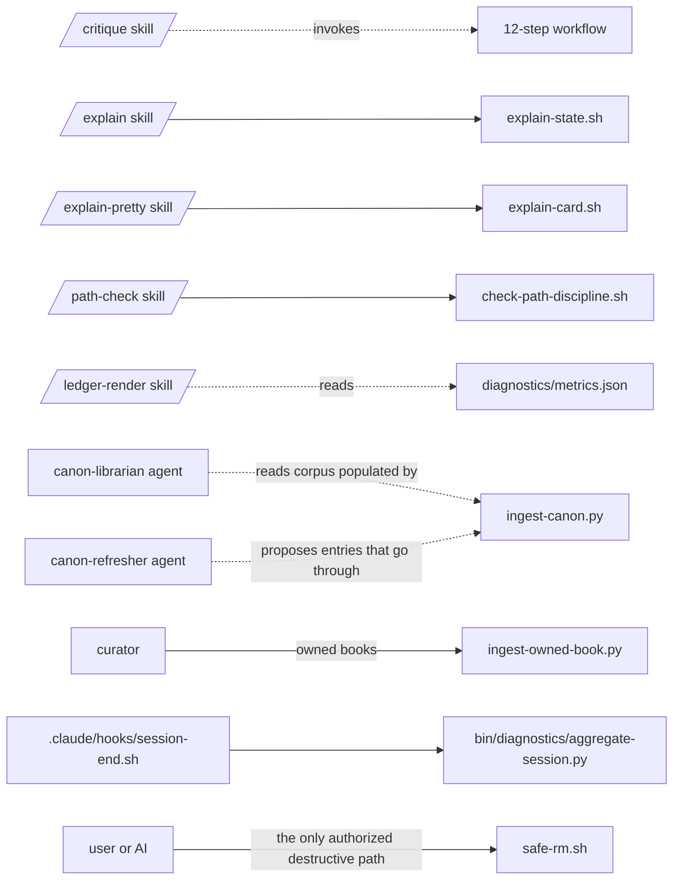

# bin/

Executable scripts and the registry that describes them. This folder holds repo-local tooling — the canon ingester, path-discipline checker, safe-delete wrapper, the legacy session-metrics parser, and the orientation cards that back the `/explain` skill.

**Read this when:** you need to invoke or edit a script, decide whether a script is safe to run without operator confirmation, or understand which scripts back which skills/agents/hooks. **Skip if:** you need the diagnostics pipeline specifically — that has its own README at [bin/diagnostics/README.md](bin/diagnostics/README.md).

## Authority — `registry.json` is the structured inventory

This README is for humans + AI walking the folder cold. **The machine-readable inventory lives in [registry.json](bin/registry.json)** — purpose, usage, writes, side effects, idempotence, consumers, tested-flag, added-date per script. Update `registry.json` on every add/remove/rename. This README mirrors the registry at a higher level.

## Inventory

| Script | Purpose | Read-only? | Idempotent? |
|---|---|---|---|
| [safe-rm.sh](bin/safe-rm.sh) | Repo-bounded delete wrapper. Refuses to delete anything outside the git repo (deletes inside are git-reversible). The ONLY authorized destructive path — direct `rm` is denied in [.claude/settings.json](.claude/settings.json). | no | yes (delete-if-exists) |
| [check-path-discipline.sh](bin/check-path-discipline.sh) | Path-discipline checker. Three modes: `--style` (flags `../`, absolute, `~/`), `--resolve` (verifies link targets exist), `--inbound` (lists inbound references). Backs the [`/path-check`](.claude/skills/path-check/SKILL.md) skill. | yes | yes |
| [ingest-canon.py](bin/ingest-canon.py) | Canon corpus ingester. Reads [canon/sources.yaml](canon/sources.yaml) (schema_version 2), filters by `lifecycle` + `fetch_mode`, fetches HTML/JSON-TOC/arXiv content into `canon/corpus/<slug>/source.txt` and writes lockfile `citation.yaml`. | no (network + writes) | yes (skips slugs whose source.txt exists; `--force` to refetch; `--only=<slug>` to restrict) |
| [ingest-owned-book.py](bin/ingest-owned-book.py) | Owned-book promoter. Promotes a `body_completeness: stub` corpus entry from a LOCAL plaintext file the operator obtained legitimately (OCR of owned ebook, publisher plaintext). Refuses if `source.txt` exists, file <10 KB, or empty; warns on suspicious paths. | no (writes) | no (refuses re-promotion) |
| [explain-state.sh](bin/explain-state.sh) | Renders the markdown orientation card. Always visible in chat. Backs the [`/explain`](.claude/skills/explain/SKILL.md) skill. | yes | yes |
| [explain-card.sh](bin/explain-card.sh) | Renders the ANSI terminal card with Calvin S figlet and tokyo-night palette. Folded by Claude Code unless `verbose: true` is set. Backs the [`/explain-pretty`](.claude/skills/explain-pretty/SKILL.md) skill. | yes | yes |
| [registry.json](bin/registry.json) | Machine-readable inventory of every script in this folder. Schema documented inline in the file. | — | — |

Plus one nested folder:

| Folder | Contents |
|---|---|
| [bin/diagnostics/](bin/diagnostics/) | Three-script diagnostics pipeline. See [bin/diagnostics/README.md](bin/diagnostics/README.md). |

---

## How scripts compose with skills / agents / hooks

The dotted lines show data flow (X reads from Y); solid arrows show invocation.

---

## Permission model — what runs automatically vs requires confirmation

From [.claude/settings.json](.claude/settings.json):

| Action | Tier |
|---|---|
| `Bash(./bin/safe-rm.sh:*)` | **allow** — repo-bounded; safer than direct `rm` |
| `Bash(bin/safe-rm.sh:*)` | **allow** — same wrapper, alt invocation form |
| `Bash(rm:*)` | **deny** — must use safe-rm.sh |
| `Bash(ls:*)`, `Bash(grep:*)`, `Bash(rg:*)`, `Bash(find:*)` | **allow** — read-only |
| `Bash(curl:*)`, `Bash(wget:*)`, `Bash(gh api:*)` | **ask** — egress requires explicit OK |

Scripts under `bin/` that perform network I/O (`ingest-canon.py`) implicitly inherit Bash permissions; the network operations themselves are not gated, but invocation patterns are visible to the user via Claude Code's tool-call permission prompts.

---

## Conventions specific to this folder

- **Every executable script must have a row in `registry.json`.** No exceptions. If you add a script and forget the registry entry, the AI walking the folder cold doesn't know it exists.
- **Network-bound scripts MUST be idempotent.** `ingest-canon.py` skips slugs whose `source.txt` exists unless `--force`. If the script doubles up or duplicates fetches, fix the idempotence first.
- **Destructive operations go through `safe-rm.sh`.** Direct `rm` is denied at the settings layer.
- **Stdlib-only Python** is the single runtime for repo scripts (ingesters + diagnostics). No external pip deps; `urllib.request`, `hashlib`, `pathlib`, `json`, `re` cover the canon ingester needs. See [bin/diagnostics/README.md](bin/diagnostics/README.md) for the conditional DuckDB exception that applies only to cross-session aggregation.
- **Zero external deps for shell scripts.** Bash + standard POSIX tools only. `jq` is allowed where present; degrade gracefully if absent.

---

## Maintenance

### Add a script

1. Drop the executable into `bin/` (or `bin/<subdir>/` if it joins a pipeline).
2. `chmod +x` it.
3. Add a row to [registry.json](bin/registry.json) with all fields: `name`, `purpose`, `usage[]`, `modes` (or `null`), `read_only`, `writes[]`, `side_effects[]`, `idempotent`, `consumed_by[]`, `tested`, `added` (YYYY-MM-DD).
4. Add a row to the inventory table in this README.
5. If the script backs a skill or agent, update that skill/agent's frontmatter `allowed-tools` and cross-link in the appropriate README.
6. If destructive, decide whether it needs settings.json `allow`/`deny`/`ask` updates.

### Edit a script

1. Edit. Test by running.
2. If the `purpose` / `usage` / `writes` changed, update `registry.json`.
3. If the script's role in a pipeline changed, update the mermaid diagram above.

### Retire a script

1. Move to deletion via `safe-rm.sh` — per the [Operating principle](README.md#operating-principle--ratchet-forward-never-sideways), avoid `.bak` files (they accumulate as clutter and confuse future readers).
2. Remove the `registry.json` row.
3. Remove the inventory row above.
4. Remove invocations from `.claude/hooks/`, settings.json `allow`/`deny`/`ask`, skill frontmatter, etc.

---

## Anti-patterns

- **`.bak` files.** The [Operating principle](README.md#operating-principle--ratchet-forward-never-sideways) is "ratchet forward, never sideways." `.bak` files are sideways — they encode the fear of deletion without commitment to it. Use git for that.
- **Scripts without registry entries.** Invisible to the AI walking the folder; high probability of being re-implemented elsewhere because nobody knew it existed.
- **Hard-coded paths.** Scripts must work from any CWD using `git rev-parse --show-toplevel` or equivalent.
- **Network I/O in supposedly read-only scripts.** If a script touches the network, mark `read_only: false` and `side_effects: ["network fetch"]` in registry.json.
- **Silent failures in destructive operations.** `safe-rm.sh` exits non-zero on any out-of-repo path. Follow that pattern.

---

## Known issues (open)

1. **No formal test suite for the ingesters.** Adding one needs cassette-style fixtures (recorded HTTP responses). Deferred R&D candidate.

---

## See also

- [registry.json](bin/registry.json) — machine-readable inventory (authoritative)
- [bin/diagnostics/README.md](bin/diagnostics/README.md) — the diagnostics pipeline
- [.claude/settings.json](.claude/settings.json) — permission model for these scripts
- [.claude/skills/README.md](.claude/skills/README.md) — skills that wrap these scripts
- [canon/README.md](canon/README.md) — schema the ingesters consume
