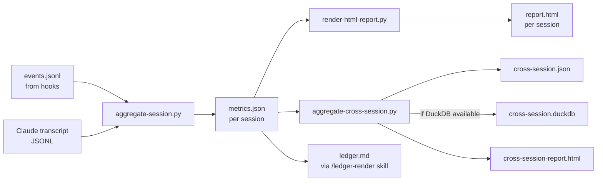

# bin/diagnostics/

The diagnostics pipeline — three Python scripts that consume the events.jsonl stream from [.claude/hooks/](.claude/hooks/) and produce per-session metrics, a per-session HTML report, and cross-session aggregations.

**Read this when:** you're editing the pipeline, adding a metric, debugging why `diagnostics/metrics.json` looks wrong, or wiring a new event field from hooks through to the report. **Skip if:** you only need to know *what hooks emit* — that's [.claude/hooks/README.md](.claude/hooks/README.md).

## Inventory

| Script | Role | Stdlib-only? | Triggered by |
|---|---|---|---|
| [aggregate-session.py](bin/diagnostics/aggregate-session.py) | Per-session parser. Reads `events.jsonl` + Claude Code transcript; writes `<session-id>/diagnostics/metrics.json`. | yes | `.claude/hooks/session-end.sh` (synchronous, once per session) |
| [render-html-report.py](bin/diagnostics/render-html-report.py) | Renders `<session-id>/report.html` from `metrics.json`. Self-contained HTML, no external assets. | yes | `.claude/hooks/session-end.sh` (synchronous) |
| [aggregate-cross-session.py](bin/diagnostics/aggregate-cross-session.py) | Walks every session's `metrics.json`; produces `.claude/.metrics/cross-session.json` + `.duckdb` (if DuckDB installed) + `cross-session-report.html`. Worktree-aware via `git worktree list`. | stdlib for `.json` + `.html`; DuckDB optional for `.duckdb` | `.claude/hooks/session-end.sh` (background, `nohup`) |

All three are **AI-blind** — they write to disk and exit; nothing flows back into the orchestrator's context.

---

## Pipeline flow



Pipeline runs in this exact order in [.claude/hooks/session-end.sh](.claude/hooks/session-end.sh):
1. `aggregate-session.py <workflow-id> <claude-uuid>` (synchronous; must complete before report renders)
2. `render-html-report.py <workflow-id>` (synchronous; consumes metrics.json)
3. `aggregate-cross-session.py` (background via `nohup`; doesn't block session close)

---

## Input contract — what `aggregate-session.py` consumes

### Primary input: `events.jsonl`

Per-line JSON events emitted by the hooks. Schema documented in [.claude/hooks/README.md](.claude/hooks/README.md) §"Event schema (OpenTelemetry GenAI-aligned)". The parser handles both:
- Legacy event shape (`{ts, tool}`) — for backwards-compat with pre-2026-05-17 sessions
- Current OTel-aligned shape (`{ts_ns, event, gen_ai.tool.name, ...}`)

Schema-aware via field inspection — neither parser version is hardcoded.

### Secondary input: Claude Code transcript

Found at `~/.claude/projects/<project>/<claude-uuid>.jsonl`. Provides:
- Per-message token usage (input, output, cache read, cache creation)
- Sub-agent boundaries via `isSidechain` markers and Agent `tool_use` blocks
- Critique verdicts via regex over assistant messages

Worktree handling: when a session ran in a git worktree, the transcript may live under a sibling project directory. `aggregate-cross-session.py` walks `git worktree list --porcelain` to find them all.

---

## Output contract — `metrics.json` schema

```json
{
  "schema_version": 2,
  "duration_seconds": 562,
  "tokens": {
    "total": { "input": 124530, "output": 18920,
               "cache_read_input": 89000, "cache_creation_input": 12500 },
    "by_agent": {
      "main":                { "input": 1344, "output": 1243758, "calls": 0, ... },
      "canon-librarian":     { "input": 22000, "output": 3200, "calls": 1, ... },
      "critic-architecture": { "input": 15000, "output": 4500, "calls": 1, ... }
    },
    "source": "subagent-stop-events" | "transcript-parsed"
  },
  "tool_calls": {
    "total": 23,
    "by_type": { "Read": 8, "Bash": 7, "Agent": 5 },
    "latency_ms_p50": { "Read": 12, "Bash": 84, "Agent": 32000 },
    "latency_ms_p95": { "Read": 28, "Bash": 411, "Agent": 71000 },
    "errors": { "Bash": 1 }
  },
  "verdicts": { "architecture": "approve",
                "operations": "approve",
                "product": "rework" },
  "verdict_confidence": { "architecture": 0.85, ... },
  "comparator_agreement": { "architecture": "agree", ... },
  "loops": 1,
  "models_seen": ["claude-opus-4-7-20260423", "claude-sonnet-4-6-20260101"],
  "errors_summary": [ { "tool": "Bash", "error_type": "ExecError", "count": 1 } ]
}
```

Two `tokens.source` values:
- `"subagent-stop-events"` — preferred; deterministic, from the `SubagentStop` hook payload. Available 2026-05-17 onward.
- `"transcript-parsed"` — fallback; reconstructs sub-agent boundaries by parsing the transcript. Used when SubagentStop events are missing (older sessions, broken hook).

---

## DuckDB dependency (optional)

`aggregate-cross-session.py` produces `cross-session.json` unconditionally (stdlib only). If `duckdb` is installed (`pip install duckdb`), it ALSO produces `cross-session.duckdb` and an HTML report with grouped/sorted/filterable views.

**Failure mode:** if DuckDB is missing, the script writes a one-line stderr hint and exits 0 (doesn't fail the SessionEnd hook chain). The `.duckdb` file is simply absent.

**Why optional:** the diagnostics pipeline MUST work on any operator's machine without forcing a Python package install. DuckDB is a quality-of-life uplift for cross-session analytics, not a load-bearing dependency.

---

## How the `/ledger-render` skill consumes `metrics.json`

The [`/ledger-render`](.claude/skills/ledger-render/SKILL.md) skill at step 13 derives:
- `agent-calls` from `tokens.by_agent` keys (excluding `"main"`)
- `artifacts` from `find <session-id> -name '*.md' -not -name 'ledger.md' | wc -l`
- `loops` from `loops` field
- `decisions` from `synthesis.md` Recommendation+Uncertainties bullet count

Then computes ratios, evaluates thresholds, emits `Ledger: ...` citation line. See [.claude/session-artifacts/README.md](.claude/session-artifacts/README.md) §"Ledger schema" for the threshold rules.

If `metrics.json` is missing (binding skipped at step 1), `/ledger-render` falls back to hand-tally and flags the missing binding as a workflow defect.

---

## Conventions specific to this folder

- **All three scripts are stdlib-only Python where possible.** The cross-session aggregator's DuckDB integration is the single optional dep — gracefully absent.
- **AI-blind output discipline.** Scripts write to disk and exit; never print to stdout/stderr unless DEBUG mode or fatal error. The SessionEnd hook redirects all output to `/dev/null` anyway.
- **`exit 0` on graceful degradation.** Missing transcript? Missing DuckDB? Old event schema? The pipeline must complete and produce *something*, not crash the SessionEnd hook chain.
- **Schema versioning.** `metrics.json` carries `schema_version`. When schema changes, bump the version and the renderer + ledger skill check the version they understand.
- **No network I/O.** These scripts read local files only. Never fetch.

---

## Maintenance

### Add a new metric

1. Identify the source: hook event (extend [.claude/hooks/](.claude/hooks/)) or transcript regex (in `aggregate-session.py`).
2. Add field to `metrics.json` output in `aggregate-session.py`. Bump `schema_version`.
3. Add display logic to `render-html-report.py` if it should appear in the per-session report.
4. Add aggregation to `aggregate-cross-session.py` if it should appear cross-session.
5. If load-bearing for `ledger.md`, update [.claude/skills/ledger-render/SKILL.md](.claude/skills/ledger-render/SKILL.md).
6. Update the `metrics.json` schema doc in this README.

### Edit an existing script

1. Edit. Pure Python; no test suite yet (deferred).
2. Test by running against an existing session: `python3 bin/diagnostics/aggregate-session.py <workflow-id> <claude-uuid>`.
3. Diff the resulting `metrics.json` against the prior run to catch regressions.

### Retire a script

1. Move to backup with `.bak.YYYYMMDD-HHMMSS` suffix — but per the [Operating principle](README.md#operating-principle--ratchet-forward-never-sideways), **prefer deletion to backup**. `.bak` files are clutter.
2. Remove the corresponding invocation from `.claude/hooks/session-end.sh`.
3. Update inventory in this README.

---

## Anti-patterns

- **Forcing a non-stdlib import without graceful fallback.** Every operator's machine must run the pipeline. DuckDB is the only conditional dep.
- **Letting parser errors crash SessionEnd.** Wrap parse loops in try/except; emit partial output if needed; never abort.
- **Adding a metric to `metrics.json` without bumping `schema_version`.** Downstream consumers can't tell what schema they got.
- **Documenting the event schema HERE.** It lives in [.claude/hooks/README.md](.claude/hooks/README.md) — single source of truth.
- **Background `aggregate-cross-session.py` not actually being background.** Must be `nohup ... &` in session-end.sh; if it blocks, SessionEnd appears to hang.

---

## Known issues (open)

1. **No test suite.** Adding one requires synthesizing realistic events.jsonl + transcript fixtures. Deferred — would be its own upgrades/ entry.

## See also

- [.claude/hooks/README.md](.claude/hooks/README.md) — event schema, hook execution flow
- [.claude/session-artifacts/README.md](.claude/session-artifacts/README.md) — `<session-id>/diagnostics/` layout, ledger schema
- [.claude/skills/ledger-render/SKILL.md](.claude/skills/ledger-render/SKILL.md) — primary consumer of `metrics.json`
- [upgrades/profound/2026-05-17-diagnostics-as-first-class/](upgrades/profound/2026-05-17-diagnostics-as-first-class/) — R&D rationale for the pipeline
