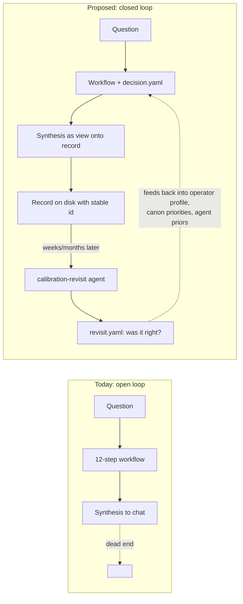

# 07 — Deep dive: decision-record-as-substrate (S1)

## Position

The workflow today produces conversation: the synthesis lands in the chat and the artifacts on disk are mostly read by the workflow itself, not by the operator after the fact and not by any later session. The proposal: make every workflow run *also* produce a small, durable, structured **decision record** — a `decision.md` plus a machine-readable `decision.yaml` — and add one new agent that periodically reopens past records to score them against what actually happened. The synthesis the operator sees becomes a *view* onto the record, not the record itself. Add one hard gate so the existing residual-disagreement contract becomes mechanical rather than prose.

Concretely, three changes:

1. **`decision.yaml`** — new artifact emitted at step 12, alongside synthesis, with stable schema (id, question, frame_revisions, recommended_path, rejected_alternatives, named_uncertainties, kill_criteria, residual_disagreements, status). The id is the existing session-id.
2. **`calibration-revisit` agent** — a new subagent invoked manually or on a cadence with `<decision-id>`. Reads the `decision.yaml`, asks the operator a small structured set of questions about what actually happened, writes `revisit.yaml` and `revisit.md` next to the original. Builds a longitudinal record. Scoring axes: *frame correct?*, *recommended path taken?*, *outcome as predicted?*
3. **Hard gate at step 12** — synthesis refuses to emit if `decision.yaml.residual_disagreements` is non-empty and no `synthesis_addressed: true` field accompanies each one. Closes the silent-failure mode I observed in the [Context7 session decision-log](../../.claude/session-artifacts/2026-04-26-context7-adoption-in-critic-stack/decision-log.md).

## The reframe this embodies

The stack today *thinks of itself as a forecasting machine*. The proposal makes it *a calibrated forecasting machine*. The distinction is not cosmetic: in the Tetlock-tradition forecasting literature, **calibration is the property that distinguishes forecasting from opinion**. A forecaster who has never been scored is, statistically, indistinguishable from a confident pundit (Tetlock, *Expert Political Judgment*, 2005; *Superforecasting*, 2015). The stack has been operating in the "confident pundit" regime — producing well-structured, well-defended judgments with no mechanism to learn from being wrong.

The reframe also changes what the *artifact-centric* workflow is *for*. Today, artifacts exist to keep the orchestrator honest within the session. Under this proposal, artifacts also exist to keep the *stack itself* honest across sessions. The shift: from session-as-product to session-as-instrument-reading.

## Mechanism — what gets added, removed, or changed

**Added:**
- One new agent under `.claude/agents/`: `calibration-revisit.md`.
- One new artifact per session: `decision.yaml` (also `decision.md` for human reading; both versions of the same content).
- One new artifact per revisit: `revisit.yaml` + `revisit.md`, written next to the source decision.
- Schema documentation, probably in [.claude/session-artifacts/README.md](../../.claude/session-artifacts/README.md).

**Removed:** nothing (this proposal is additive; the *removals* live in S2 and S5, deliberately separate so they can be evaluated separately).

**Changed:**
- Step 12 in [CLAUDE.md](../../CLAUDE.md): now also emits `decision.yaml` with the structured fields, and refuses to emit if the residual-disagreement gate fails.
- The session-artifacts README's claim that "no agent is instructed to read prior sessions" weakens to "no agent reads prior sessions *during the workflow*; calibration-revisit reads exactly one prior session at a time, by id, in a separate invocation." The within-session-voice property is preserved because revisit is a separate operation.

**Surface area:** small. ~1 agent file, ~1 schema file, ~3 paragraph changes in [CLAUDE.md](../../CLAUDE.md), ~1 paragraph in the session-artifacts README, the gate logic in step 12.

## Literature this draws on

- Tetlock & Gardner, *Superforecasting* (2015) — and the Good Judgment Project tournament data behind it. The single clearest evidence for *measuring* forecasts producing better forecasts than not measuring them. In the canon manifest as a stub.
- Kahneman & Lovallo, *Timid Choices and Bold Forecasts* (1993, *Management Science*) — already in the canon. The reference-class-forecasting move *implies* a back-test discipline; the stack imports the technique without the back-test.
- Klein, *Sources of Power* (1998) and *Performing a Project Premortem* (2007, *HBR*) — pre-mortems are pre-calibrated; revisits are post-calibrated; doing both gives a complete cycle. Klein's evidence is that imagined post-mortems surface risks that prospective analysis does not.
- Heuer, *Psychology of Intelligence Analysis* (1999, CIA Center for the Study of Intelligence) — the analysis-of-competing-hypotheses tradition explicitly assumes a *track record* is being built.
- Karpathy on agent loops (e.g. *State of GPT*, 2023) — reflection without grounding produces drift; grounding requires either a verifier or a back-test.

**Contradicting evidence I am required to surface.** Not all calibration regimes improve performance. Mellers, Tetlock, et al., *Identifying and Cultivating Superforecasters as a Method of Improving Probabilistic Predictions* (2015, *Perspectives on Psychological Science*) show that calibration improves *aggregate* accuracy strongly but improves *individual* accuracy only when paired with deliberate training and feedback — calibration as bookkeeping with no training did not measurably help. The risk: this proposal builds the bookkeeping without the training loop.

## Known failure modes (≥3, named)

1. **Operator never answers the revisits.** Calibration-revisit produces `revisit.yaml` stubs that sit empty because answering "what happened with the ark-mono routing decision six months later" is real cognitive work and the operator deprioritises it. After three months the calibration record is mostly unfilled and the substrate is theatrical.
2. **Outcomes are not actually scoreable.** Many design decisions don't have crisp outcomes — *"the team adopted the recommendation but it's hard to say if the alternative would have worked better."* The scoring axes degrade into "directionally fine, I guess." Calibration noise dominates calibration signal.
3. **The schema ossifies and stops matching reality.** `decision.yaml`'s fields (recommended_path, named_uncertainties, etc.) are designed at one moment in the stack's evolution; by the time enough revisits exist to be useful, the workflow has moved on and the schema fights the current shape rather than supporting it. Versioning helps but does not fix.
4. **Self-preference bias contaminates revisits.** The calibration-revisit agent is the same model family as the orchestrator that produced the original recommendation. There is documented self-preference bias (Panickssery, Bowman, Feng, 2024; arXiv:2404.13076). The revisit agent may systematically grade past recommendations more favorably than they deserve.

## Kill criteria (≥3, observable)

- **Three months in, fewer than 30% of decision records have a filled revisit.** The substrate is theatrical; abandon and revisit the design.
- **Six months in, the inter-revisit agreement (operator vs. calibration-revisit agent on the same record) is no better than chance on the *frame correct?* axis.** The schema is not capturing what would distinguish a good from a bad recommendation; the substrate is not measuring what it claims to measure.
- **The hard gate at step 12 is bypassed by adding `synthesis_addressed: true` ritualistically without substantive engagement** — observed by reading three consecutive sessions and finding the addressed text is template-shaped, not substantive. The gate is being box-ticked.
- **The schema versioning becomes an active maintenance pain** — i.e., more than two schema-version migrations in the first six months, each breaking past records. This means the schema was wrong, and the substrate is now technical debt.

## Cheapest experiment (the smallest test that distinguishes "real" from "mirage")

**One operator, three weeks, three real decisions.** Run the next three real workflow sessions normally, but *also* write a `decision.yaml` by hand from each session's existing artifacts. After three weeks, ask: (a) was the by-hand authoring of `decision.yaml` painful? (b) when revisiting one of the three records, was the structured form *more useful* than re-reading the markdown synthesis? (c) what fields in the by-hand `decision.yaml` would I have wanted that I did not include?

Total time investment: ~30 minutes per session, three sessions, plus one ~45-minute revisit at the end of week three. Total: ~2.5 hours. Success metric: a yes/no answer to (b), and a concrete schema delta from (c) that becomes the v1 schema if the answer is yes. Reject metric: by-hand authoring takes more than ~30 minutes per session, *or* the structured form does not surface anything the markdown synthesis missed.

## Sequence — what before what

1. Hand-authored `decision.yaml` on three real sessions (the cheapest experiment above). Decide go/no-go.
2. If go: codify the schema as `.claude/schemas/decision.v1.yaml` (or an equivalent unambiguous home).
3. Modify step 12 in [CLAUDE.md](../../CLAUDE.md) to require `decision.yaml` emission alongside the chat synthesis. Update the session-artifacts README.
4. Wire the residual-disagreement hard gate (small; same edit as 3).
5. Author the `calibration-revisit` agent. Smallest possible: takes a session id, writes `revisit.yaml` stub with the right questions, lets the operator fill it in.
6. After ~6 weeks, do one full revisit pass over the existing accumulated records to populate baseline data.
7. After ~3 months, run the kill-criteria check.

The hard external dependency: nothing. This is purely repo-internal.

## Counter-proposal

The strongest alternative to this whole proposal is *don't build a substrate; build a habit*. The "habit" version: the operator commits to a quarterly self-review of recent sessions, no new artifacts, no new agent — just an hour spent re-reading the last quarter's session-artifacts and writing a short `2026-Q3-review.md` in the operator's own voice. This is cheaper, requires no schema, and may capture more honest signal because it is operator-authored from the start.

I rank the substrate proposal above the habit proposal because: (a) the habit version is what the operator would notionally already be doing if they were going to, and they aren't; (b) the substrate version produces *machine-readable* fields that future agents (operator-bias profile, cross-session retrieval, ablation harness) can build on, while the habit version is a dead end; (c) the substrate version exposes the `revisit_filled: false` truth — the failure mode where the operator never answers — visibly, while the habit version hides that failure as a missing file. But the habit version is a real alternative; if the operator's honest self-assessment is that they will not answer revisits, the habit version is more truthful and the substrate version is theatre. That self-assessment is the precondition this proposal cannot replace.
