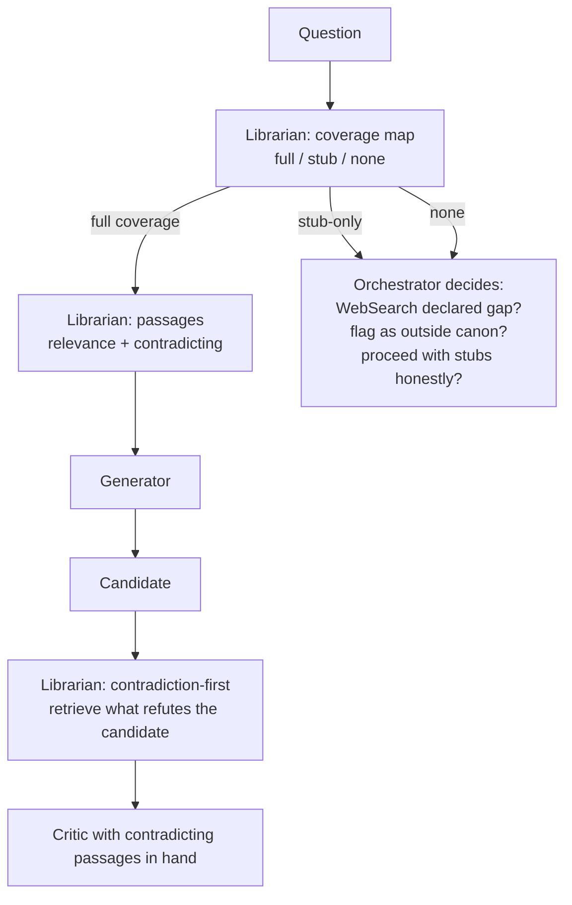

# 07 — Deep dive: inverted librarian + corpus-coverage map (S4)

## Position

Two coupled changes to [canon-librarian](../../.claude/agents/canon-librarian.md):

1. **Coverage-map first.** The librarian's first emission for any query is a *coverage map* — for the topic at hand, what does the corpus have full coverage of, what is stub-only, what is uncovered. Passages come *after* the map, and the map is what the orchestrator decides on.
2. **Contradiction-first invocation.** Add a second, distinct invocation mode used at step 9 or 10: given the *candidate recommendation*, retrieve only what would refute it. The contradiction-first results become an explicit input to the critic step.

The two changes share an underlying move: stop pretending the corpus is uniformly authoritative. Today the librarian's contract is *find the relevant passage and find one contradicting one*; this works when the corpus has multiple voices on a topic and degrades silently when it does not. Both changes make corpus brittleness *visible at use time* rather than papering over it with stretched relevance.

## The reframe this embodies

The librarian today operates as if the corpus is a finished library with a known contradiction structure. Reading [canon/sources.yaml](../../canon/sources.yaml) against [canon/corpus/](../../canon/corpus/), the actual library is *aspirational*, *Anthropic-engineering-heavy*, and *stub-heavy on the canonical books*. The librarian's "must contradict" rule is structurally good but practically vulnerable to the failure where the only contradicting passage on a topic is a stub or a tangential one — and the librarian, prompted to find a contradiction, will produce something rather than admit it cannot.

The reframe: **the corpus is a known-incomplete instrument, and the librarian's first job is to disclose its instrument-limits**. Only after disclosure does retrieval happen. The orchestrator's downstream choices (when to skip canon, when to `WebSearch`, when to flag a question as "outside the canon's competence") become honest because the limits are surfaced.

Contradiction-first is the dual of relevance-first. The librarian today does *both* in one call, biased by the prompt order toward relevance; splitting them into two invocations gives each its own discipline. Contradiction-first applied to the candidate (not the question) is also closer to what an *adversarial* corpus would be doing — it is the canon as devil's advocate rather than the canon as supportive resource.

## Mechanism — what gets added, removed, or changed

**Added:**
- Coverage-map output mode in [canon-librarian.md](../../.claude/agents/canon-librarian.md). New section in the agent's required output, emitted *first*. Schema: per-topic, three buckets (full / stub / none) with the slug and a one-line note.
- Contradiction-first invocation mode in the same agent. Distinct from the existing relevance-first invocation: takes the candidate as input, returns only refuting passages.
- A new step in [CLAUDE.md](../../CLAUDE.md): step 9.5 (or step 10 sub-step), invoking contradiction-first librarian with the candidate, before critic-panel runs. The critic-panel reads the contradicting passages.

**Removed:** nothing. The existing librarian behaviour (relevance + at-least-one-contradicting-passage in one call) survives as the relevance-first invocation; the new modes are additive.

**Changed:**
- The librarian's mandatory-behaviour section (today: "Treat the query charitably, then adversarially") now explicitly distinguishes the two modes and says when each runs.
- Step 3–5 in [CLAUDE.md](../../CLAUDE.md): the parallel-gather now expects the librarian to emit coverage map *first*, passages second. The orchestrator may halt the gather if the coverage map is "none" and decide differently (route to WebSearch, or flag the question).
- Steps 9 → 10: a contradiction-first librarian call lands between them. Critiques operate against both the candidate and the refuting-passage set.

**Surface area.** Modest. ~2 sections added to [canon-librarian.md](../../.claude/agents/canon-librarian.md), ~2 paragraphs in [CLAUDE.md](../../CLAUDE.md). The hardest part is the prompt design for contradiction-first — getting "find me what refutes this" to produce sharp passages rather than gentle qualifications.

## Literature this draws on

- The *case-based reasoning* tradition (Kolodner, *Case-Based Reasoning*, 1993; later AI work): retrieval against a candidate ("find prior cases that contradict this one") is a known and effective primitive.
- Heuer, *Psychology of Intelligence Analysis* (1999) — the *Analysis of Competing Hypotheses* chapter explicitly recommends seeking *disconfirming* evidence as a separate, deliberate operation. The proposal is essentially ACH applied to retrieval.
- Klein, *Sources of Power* (1998) — naturalistic-decision-making research consistently finds that *imagined disconfirmation* improves expert decisions. The contradiction-first invocation is the retrieval equivalent.
- Lewis, Perez, et al., *Retrieval-Augmented Generation* (2020; arXiv:2005.11401) — the foundational RAG paper. The proposal departs from the standard RAG framing by adding the coverage-map-first move; standard RAG assumes coverage and produces nearest-neighbour. Coverage-aware retrieval is comparatively rare in production RAG systems.
- Anthropic, *Effective Context Engineering for AI Agents* (2025; in canon at [anthropic-effective-context-engineering](../../canon/corpus/anthropic-effective-context-engineering/)) — the *what to put in context, what to leave out* discipline. Coverage-map first is the discipline applied to retrieval input.

**Contradicting evidence.** Two things to surface honestly. First, the contradiction-first invocation may produce *no* refuting passages for many candidates — not because the candidate is right, but because the corpus has no contrary view. The librarian will need to say "no refutations found in corpus" rather than fabricating, and the orchestrator must read that as *uninformative*, not as *vindicating*. Second, coverage-map output may produce a chilling effect: the operator sees "stub-only" and reflexively skips canon, defeating the librarian-first rule the stack is built on. The map should disclose, not discourage.

A third honest point: the contradiction-first move risks **producing brittle anti-recommendations** — passages selected to refute can be misread as more-authoritative-than-they-are because they were retrieved against a *specific claim*. The librarian must keep its citation discipline (year, context, stale-flag) on contradiction-first results just as on relevance-first results.

## Known failure modes (≥3, named)

1. **The coverage map becomes a chill.** Operator sees "stub-only" and routes around canon by reflex; the librarian-first rule erodes. The chill is most likely on topics where the operator has strong prior views (security, frontend) and the canon is honestly thin.
2. **Contradiction-first retrieval finds nothing on most candidates.** The corpus has one voice on most topics; refuting passages are sparse. The librarian's "no refutations found" is the honest output and the orchestrator may not handle it well — agreeability can creep in via "no refutations means this is sound," which is exactly wrong.
3. **The two-mode librarian becomes the canonical point of contradicting-passage drift.** Today, every librarian call must include a contradiction; under the proposal, contradictions concentrate in the contradiction-first mode and the relevance-first mode may stop producing them. Net contradicting-passage volume may drop.
4. **Step 9.5 becomes a step the orchestrator is tempted to skip when the candidate seems uncontroversial.** Skipping is exactly when contradiction-first would have most caught a blind spot. Discipline lives in the prompt; discipline drifts.

## Kill criteria (≥3, observable)

- **Coverage map output is "none" or "stub-only" on more than ~50% of real queries over a quarter, *and* the operator routes around canon on most of them.** The honest read is that the corpus is too narrow for the question distribution; the right move is corpus expansion (a different proposal), not librarian-mode work. The coverage map has done its diagnostic job and the librarian changes were the wrong response.
- **Contradiction-first retrieval produces no refutations on more than ~70% of candidates.** Either the corpus has no contrary voices on most topics (corpus problem), or the prompt is producing false negatives. Either way, the contradiction-first invocation is not earning its tokens.
- **The orchestrator skips step 9.5 ("contradiction-first") on more than ~30% of real sessions.** Discipline has drifted; the new step is theatre. Either re-author it as a hard precondition for critic-panel, or remove it.
- **Net contradicting-passages-per-session drops** vs. the pre-proposal baseline. The split made things worse, not better.

## Cheapest experiment

**Two scenarios, no agent edits, ~2 hours.** Take two recent sessions whose `decision.yaml` (assuming S1 is in flight) or whose final synthesis exists. For each, manually invoke the librarian twice: once asking for a coverage map of the question topic; once asking for refutations of the produced candidate. Compare to what the original librarian invocation surfaced. Did the coverage-map invocation reveal a thin spot the original session ignored? Did the contradiction-first invocation produce sharper refutations than the original "at least one contradicting passage" rule produced? If the answer to either is yes for at least one of the two scenarios, the proposal is worth building. If no on both, the existing librarian behaviour is doing the work the split would do, and the split is overhead.

Total: ~2 hours of operator time. Success metric: a yes/no per scenario plus, on yes, a concrete passage the original session missed and the candidate would have been improved by reading.

## Sequence

1. Cheapest experiment above. Decide go/no-go.
2. If go: revise [canon-librarian.md](../../.claude/agents/canon-librarian.md) to specify both modes and the coverage-map-first contract. Keep the existing relevance-first behaviour as one mode; add the contradiction-first mode.
3. Add step 9.5 to [CLAUDE.md](../../CLAUDE.md) — the contradiction-first librarian call between generator and critic-panel.
4. Add the coverage-map-first behaviour to steps 3–5 (parallel gather).
5. Convert one existing scenario in `evals/` (assuming S3 is in flight) to assert on coverage-map output and contradiction-first output, so the harness catches regressions.
6. After ~6 weeks: run the kill-criteria check.

External dependency: helps to be sequenced after S3 (eval harness), so corpus-shape effects can be measured. Could ship before S1 (decision-record) without coupling.

## Counter-proposal

The strongest alternative is *don't change the librarian; expand the corpus*. The thin-coverage problem is a corpus problem; the right fix is more entries (especially the books that are currently stubs) and active outreach for contrary voices on contested topics. This keeps the librarian's contract simple and addresses the root cause.

I rank the inverted-librarian proposal slightly above expand-the-corpus for two reasons. First, corpus expansion is *slow and licence-bound* — most of the stub books require either subscription text or OCR'd plaintext the operator must source manually. The proposal works under the corpus shape that actually exists rather than the one the manifest aspires to. Second, even under a fully-expanded corpus, the contradiction-first invocation against a *candidate* (not against the question) is a different and useful discipline that the relevance-first librarian does not provide; expand-the-corpus does not deliver it.

But the corpus-expansion alternative is not wrong, and the two are not exclusive. If the operator's diagnosis is that the canon is the bottleneck, this proposal is a band-aid; if the diagnosis is that the canon is roughly the right size for now and the librarian's *behaviour* is the bottleneck, this proposal is the move. The cheapest experiment above is, in effect, the diagnostic that distinguishes the two.
