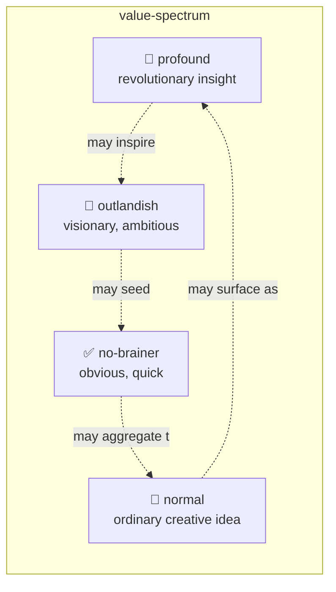
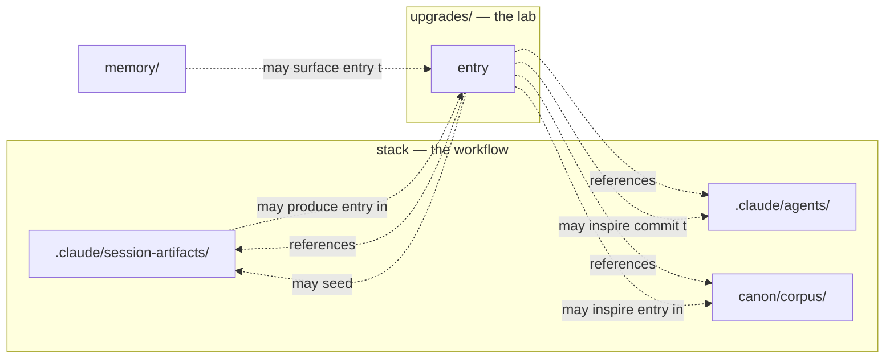

# An R&D lab for the critic-stack — organized by value-tier, not by target system

| Field | Value |
|---|---|
| 📌 **title** | An R&D lab for the critic-stack — organized by value-tier, not by target system |
| 🎯 **tier** | ✅ no-brainer |
| 👤 **author** | collaborative |
| 📅 **created** | 2026-04-26 |
| ⚡ **catalyst** | A multi-turn conversation about giving this repo a place to capture profound, novel, and creative ideas about elevating the AI system, distinct from session-artifacts. The first attempt over-engineered the answer with maturity ladders, bash tooling, and time-boxes; the operator rejected it as process-heavy. The second attempt organized by shape-of-thought; the operator clarified they wanted organization by value-tier so classification is unambiguous and every tier gets actively populated. This entry is the resulting design. |
| 💡 **essence** | A lab is not a publication system. Its discipline is the act of writing the thought down, not the structure of what's written. Organizing by value-tier — with explicit boundaries — encourages thinking across the full spectrum and makes filing automatic so capture is never blocked by classification. |
| 🚀 **upgrade** | Without this lab, profound thoughts about how to elevate the AI system die in conversation, get smuggled into session-artifacts where they expire with the session, or are silently dismissed as "too small" or "too ambitious." With it, the system accumulates an institutional memory of upgrade thinking that compounds over months and years, and the AI is explicitly encouraged to think across all four tiers rather than only in the register the current session demands. |
| 🏷️ **tags** | meta, foundation, lab-design, knowledge-management, tier-organization |

| 🌱 created | 🔬 spiked | 📋 prepared | ✅ accepted | ⚙️ run-through-repo | 🔨 implemented | 💎 value-proved | 🏁 completed |
|---|---|---|---|---|---|---|---|
| 2026-04-26 | — | — | — | — | — | — | — |

## Table of contents

- [Why this lab exists](#why-this-lab-exists)
- [What an R&D lab actually is](#what-an-rd-lab-actually-is)
- [Why organize by value-tier — and why these four tiers](#why-organize-by-value-tier--and-why-these-four-tiers)
- [The four tiers, in detail](#the-four-tiers-in-detail)
- [The discipline of writing across all four tiers](#the-discipline-of-writing-across-all-four-tiers)
- [The relationship between an entry and the rest of the repo](#the-relationship-between-an-entry-and-the-rest-of-the-repo)
- [Format, the two prepended tables, and the discipline of the TOC](#format-the-two-prepended-tables-and-the-discipline-of-the-toc)
- [The state lifecycle as a visible spine](#the-state-lifecycle-as-a-visible-spine)
- [The `/upgrade` slash command — fast capture](#the-upgrade-slash-command--fast-capture)
- [Why the lab is independent of the workflow](#why-the-lab-is-independent-of-the-workflow)
- [What this lab is not — explicitly](#what-this-lab-is-not--explicitly)
- [Open questions left for the lab itself to answer](#open-questions-left-for-the-lab-itself-to-answer)
- [The follow-up entries this lab needs immediately](#the-follow-up-entries-this-lab-needs-immediately)

---

## Why this lab exists

Every session of this stack produces ephemeral artifacts: requirement, frame, distillations, scope-map, challenges, candidate, critiques, synthesis. They live in `.claude/session-artifacts/<id>/` and answer the question that brought them into being. When that question is closed, those artifacts are correct in their context and irrelevant to anything else.

But sometimes — in the middle of producing those artifacts, in the conversation around them, or in re-reading them weeks later — a thought surfaces that is *not about that question*. A pattern across sessions. A reframing that recasts the workflow itself. A speculation about what the stack could become. A provocation that says "we are doing this wrong." A small obvious win that nobody bothered to write down because it was too small. A wild ambitious moonshot that nobody bothered to write down because it was too big. These thoughts have nowhere to live. The session-artifact is the wrong home; conversation is too ephemeral; commits and `CLAUDE.md` updates demand the thought already be a decision.

This lab is the home for thoughts that are not yet decisions, not yet capabilities, not yet anything other than profound enough to be worth writing down properly.

## What an R&D lab actually is

The phrase has been overloaded. In modern industry it often means a budget line and a building. Historically it means something more useful:

| Tradition | What it produced | Discipline |
|---|---|---|
| **Faraday's notebooks** (1820s–60s) | Numbered paragraphs, dated, indexed retroactively | Atomic observations; structure emerged from years of indexing |
| **Edison's notebooks** (1870s–90s) | Chronological, witnessed, every false start preserved | Failure-archive embedded in the same flow as success |
| **da Vinci's codices** (1480s–1510s) | Mechanical sketches, anatomical drawings, lists, observations all mixed | No imposed taxonomy; cross-domain proximity *was* the method |
| **Bell Labs / PARC notebooks** (1950s–80s) | Informal memos, technical reports, "white papers" in the original sense | Tiered formality from scratch to publication, but scratch lived alongside polished |
| **Luhmann's Zettelkasten** (1950s–98) | Atomic notes, IDed, linked into a graph | Structure from emergent connection, not pre-imposed taxonomy |

The pattern across all of these:

> Real R&D operations do not impose structure on thinking before the thinking exists. They impose structure on **the act of writing the thought down** — a date, an ID, a sentence — and let larger structure accrete from the corpus over time.

The first attempt at this lab violated that pattern. It pre-specified maturity ladders, document types, cross-reference vocabularies, and bash tooling — structure for content that did not yet exist. The corrective is to keep the *act of writing* disciplined (TOC, meta table, state table, beautiful prose) and to let the larger questions (which entries are good, which directions matter, which patterns recur) be answered by the entries themselves over time.

## Why organize by value-tier — and why these four tiers

Three organizing axes were considered:

1. **By target system** — folders for "harness," "agents," "corpus," "workflow," "memory." Each entry filed by what part of the system it touches.
2. **By shape of thought** — folders for the cognitive operation the entry performs (observation, reframing, provocation, speculation, synthesis, proposal, reflection).
3. **By value-tier** — folders for the value-and-scope spectrum of the upgrade idea (profound, outlandish, no-brainer, normal).

The **first** is wrong because the system evolves; folders become graveyards for entries about deprecated parts of the system, and cross-cutting ideas have no obvious home.

The **second** is interesting (the cognitive shape of a thought is stable across system evolution) but it serves a *bookkeeping* purpose, not a generative one. It tells you what kind of thinking happened; it does not encourage you to think in registers you weren't already using.

The **third** is the one chosen, for a specific reason that goes beyond filing:

> The point of value-tier folders is **not to sort entries — it is to encourage thinking across the full spectrum**.

A solo operator with an AI partner has a real failure mode: thinking only in the register the current session demands. If today's session is about a small fix, no profound moonshots get written. If today's session is about a big rewrite, no small no-brainer wins get captured. Tier folders are *prompts to think* — when an entry lands and the operator sees the four tier folders, the implicit question is: *am I thinking about all four kinds of upgrade today, or only the kind this session pulled me into?*

An empty tier folder, three months in, is a signal worth heeding: thinking has gotten too narrow. A balanced lab has entries flowing into all four tiers over time.

The cognitive-shape distinction is preserved as an **optional writing prompt** in the lab's README — useful when the operator stares at a blank entry and isn't sure what kind of thing this is. But it is not the filing structure.

## The four tiers, in detail

The arrows are suggestive, not normative — entries don't have to flow between tiers. But the diagram captures a real dynamic: a profound insight often suggests an outlandish project; an outlandish project often produces no-brainer prerequisites along the way; collected no-brainers sometimes pattern-match into a single profound observation in retrospect.

### 💎 profound

A revolutionary insight that would fundamentally change how the system works. The kind of idea that, once seen, makes the prior approach look obviously incomplete. Novel — something we genuinely had not considered.

**Test:** Would I be excited to tell another engineer about this? Would they, on hearing it, say "wait, *what*"?

**Examples** (not yet written): "Memory and the lab are the same primitive at different timescales." "Critic verdicts should be statistical distributions, not categorical labels." "The workflow's hard gates and the lab's tier folders are isomorphic."

**Boundary:** if the insight feels comfortable or expected, it is probably not profound — it is normal or no-brainer. Profound entries should make the writer slightly nervous to publish.

### 🚀 outlandish

A visionary, ambitious, long-timeline idea. May require significant planning, may be unproven, may be impractical — but exciting. The moonshots, the multi-month projects, the "what if we built X over a year" ideas.

**Test:** Is this a months-long project, or an unproven moonshot? Does it require planning surface large enough that no single session could plan it?

**Examples** (not yet written): "Build a parallel research stack that talks to this one only via the corpus." "Replace the orchestrator with a swarm of specialist agents arbitrated by an external model." "Cross-train this stack with a different model family for adversarial-by-construction critique."

**Boundary:** outlandish ≠ unrealistic. An outlandish entry should still be honest about feasibility; the boundary is *scope and ambition*, not *fantasy*.

### ✅ no-brainer

An obvious win. Low effort, uncontroversial value, can be implemented quickly. The ideas that, once stated, prompt the question "why didn't we do this already?"

**Test:** Would I implement this immediately if I had 30 minutes?

**Examples**: "Add `Write` to critic agent frontmatter so they can persist their own verdicts." This very lab's design entry sits in this tier — having a folder for upgrade ideas is obvious value.

**Boundary:** the danger of this tier is that obvious wins are *too easy to dismiss as not worth writing down*. The no-brainer tier exists to fight that bias — small obvious wins compound, and writing them down makes their compounding visible. If you find yourself thinking "this is too small to capture," that is exactly the kind of entry this tier is for.

### 🌿 normal

An ordinary creative idea. Modest impact, modest effort. The bread and butter of upgrade thinking — neither tiny nor huge, neither revolutionary nor visionary, just a reasonable thought worth recording.

**Test:** None of the above tiers more strongly fits.

**Examples** (not yet written): "Tighten the canon-librarian's contradiction-passage requirement to specifically demand source-diversity." "Add a `confidence:` field to distillation claims."

**Boundary:** normal is the default. When in doubt between tiers, default downward (normal over no-brainer; no-brainer over outlandish; outlandish over profound). Entries can be promoted to a higher tier later if their value turns out larger than first thought; that is one line of frontmatter, not a rewrite.

## The discipline of writing across all four tiers

The tier system is not just a filing structure; it is a **prompt-to-think** that the lab's existence puts in front of the operator and AI on every session.

The implicit question, every time the lab is opened: *Am I generating ideas in all four tiers, or only the one this session's mood pulled me into?*

A useful diagnostic, applied periodically:

- If `profound/` is empty after 3 months: thinking has been too pragmatic; no big-picture reframing is happening. Force-yield: pick the most familiar assumption about the system and try to refute it.
- If `outlandish/` is empty after 3 months: thinking has been too constrained; no moonshots are surfacing. Force-yield: ask "if budget and time were free, what would I build?"
- If `no-brainer/` is empty after 3 months: thinking has been too elevated; small obvious wins are being dismissed. Force-yield: list the friction points of the last 5 sessions and write them down.
- If `normal/` is empty after 3 months: probably no real thinking is happening at all; the lab has become a museum.

The diagnostic does not require any new tooling — `ls upgrades/<tier>/` is sufficient.

## The relationship between an entry and the rest of the repo

The lab is not above or below the workflow; it is **adjacent**. An entry can reference any artifact in the stack; the stack can reference an entry. Neither owns the other.

Concretely:

- A profound observation surfaced during a session is captured here, not in the session-artifact. The session-artifact has its own logic and its lifecycle ends with synthesis.
- A no-brainer entry that gets implemented becomes one or more commits and possibly an addition to `CLAUDE.md` or a new agent. The entry stays in the lab as the historical record (its state moves to 🔨 `implemented`); the implementation is elsewhere.
- An outlandish entry may be promoted into a future design session — it becomes the *requirement* of a new session whose synthesis lives in `.claude/session-artifacts/`. The entry's state moves to ⚙️ `run-through-repo`.
- The canon-librarian may, at retrieval time, surface a lab entry alongside canon passages when relevant.

## Format, the two prepended tables, and the discipline of the TOC

Every entry has the same structural skeleton:

1. **H1 title.**
2. **Meta table** (vertical, two columns): `title`, `tier`, `author`, `created`, `catalyst`, `essence`, `upgrade`. Optional rows: `tags`, `relates_to`.
3. **State table** (vertical, two columns): all eight states listed; reached states have a date, un-reached show em-dash.
4. **TOC** (always required, regardless of length).
5. **Body** (free-form prose, beautifully written).

Three things deserve their own argument:

**The two tables are visible, not hidden.** No YAML frontmatter — markdown tables that render in any viewer. The meta table is what you see first when opening the entry; the state table is right below it. Together they tell the reader, in five seconds, what this entry is and how far along it has come.

**The TOC is required for every entry, regardless of length.** Even a five-paragraph observation gets a TOC. The reason is not navigation; it is composition discipline. Writing a TOC requires naming sections, which requires the writer to know what the entry *is about* before the reader has to figure it out.

**The seven meta fields are all required.** Five orient the reader (`title`, `tier`, `author`, `created`, `catalyst`); two do real cognitive work (`essence`, `upgrade`). `essence` is the punchline — if the rest of the entry were lost, what is the one thought that would be missed? `upgrade` names the consequence — *how does the system get better if this is right?* An entry whose `essence` is hand-wavy is probably not yet thought through; an entry whose `upgrade` is empty is probably not actually about upgrading the system.

## The state lifecycle as a visible spine

The state table makes lifecycle progression visible at a glance. Most entries never reach `completed`; that's fine. Some entries stop at `created` and stay there; that's also fine. The lifecycle is a *spine* the entry can climb, not a *requirement* it must fulfill.

| Color | State | Meaning |
|---|---|---|
| 🌱 | **created** | The entry exists. Just written down. |
| 🔬 | **spiked** | Someone did exploratory or prototype work — quick probe to see if the idea is viable. |
| 📋 | **prepared** | Detailed enough that next steps are clear. Ready to be acted on or formally proposed. |
| ✅ | **accepted** | Operator has agreed: this is worth pursuing. |
| ⚙️ | **run-through-repo** | The idea was put through the 12-step adversarial-review workflow as a design question. |
| 🔨 | **implemented** | The change is live in the repo. |
| 💎 | **value-proved** | The implementation has demonstrated value in real sessions. Not just shipped — *worked*. |
| 🏁 | **completed** | Closed. No more action expected. The entry stays as historical record. |

A state is reached by editing the table to fill in the date. There is no automation; it's a manual act of "yes, this happened." If a state is reached out of order (e.g., `implemented` before `accepted` because the operator just did it), fill in both dates honestly — the lifecycle is descriptive, not prescriptive.

If an idea turns out to be wrong or no longer worth pursuing, mark this in prose at the top of the body — the lab is free-form enough to absorb honest negation without needing a separate `killed` state. Examples for this entry's own state, hypothetically: were the lab ever to be obsoleted by a better mechanism, the body would gain a section ("why this is now wrong") and the state would move to 🏁 `completed` with a date.

## The `/upgrade` slash command — fast capture

For one-shot capture, `/upgrade <thought>` invokes a slash command that:

1. Reads the input.
2. Decides the tier using the decision rule.
3. Generates the meta-table fields (`catalyst`, `essence`, `upgrade`) from the input + current conversation context.
4. Picks a slug.
5. Generates the state table with `created` filled in (and other states em-dashed).
6. Generates a TOC.
7. Writes a beautifully-formatted entry to the right tier folder.
8. Reports back what was created.

The operator just dumps the thought; the AI does the formatting and filing. This is the right level of automation: the act of capture should not have to compete with the act of thinking. A separate "formatter agent" was considered and rejected as overkill — the AI in main conversation is already capable of inline formatting; the slash command is the UI affordance that makes it one-shot.

Direct file authoring (without the slash command) is also fine — sometimes the operator wants full control, especially for `profound/` and `outlandish/` entries where the prose itself is part of the idea.

The command is defined at `.claude/commands/upgrade.md`.

## Why the lab is independent of the workflow

The original instinct — to integrate the lab tightly with the 12-step workflow via curator agents, promotion ports, and Step 14 reflection hooks — was wrong. Tight integration would have forced the lab to inherit the workflow's biases (toward thoroughness, toward closure, toward synthesizing-into-decisions). The lab needs the *opposite* biases: toward open questions, toward thoughts that don't close, toward speculation that may not pay off for years.

Independence is concrete:

- The workflow does not require a lab entry as a precondition for any step.
- The lab does not require a session-artifact as a precondition for any entry.
- The two systems read each other freely (entries can cite artifacts; agents can read entries) but neither writes into the other.
- An entry's lifecycle (the visible state spine) is unrelated to a session's lifecycle (created → synthesized → archived).

This is the ports-and-adapters pattern reduced to its minimum: one port (the filesystem). Either system can change without breaking the other.

## What this lab is not — explicitly

- **Not a backlog.** Entries don't have priority fields. The state lifecycle tracks progress, not urgency.
- **Not a roadmap.** No ordering by sequence. The state of one entry has no relationship to the state of another.
- **Not the workflow's institutional memory.** Memory has a separate home (`memory/`).
- **Not a place for routine notes.** A passing thought from a phone call goes in `pages/`. The lab is for thoughts profound enough to deserve a TOC, the seven meta fields, the state spine, and beautiful prose.

## Open questions left for the lab itself to answer

These are questions the lab's design deliberately *does not* answer up front, because the right answers depend on what the lab actually accumulates. Future entries (likely reflections at 6 months and 12 months) should address them:

1. **Do the four tiers hold their boundaries in practice?** If real entries consistently sit between two tiers, the boundaries need refinement.
2. **Do the eight states cover what entries actually do?** If many entries skip several states or get stuck between two, the lifecycle is wrong.
3. **Does the cross-tier diagnostic work?** The "empty tier after 3 months = thinking has gotten too narrow" rule is conjecture.
4. **Does the seven-field meta table hold under speed?** A capture-first regime says "write fast or you don't write." A seven-required-field regime says "write enough to fill these in." The slash command may or may not absorb the tension.
5. **Do entries get re-read?** A lab where entries are written and never read again is a graveyard. Signal: whether new entries cite older entries via `relates_to`.

## The follow-up entries this lab needs immediately

These are entries that should be written next, by the operator or AI or both. They are not part of *this* entry's design; they are the entries this lab's existence implies:

1. **`no-brainer/2026-04-26-subagent-claimed-writes-not-on-disk.md`** — The `requirement-classifier` reported writing a file that was not on disk during this very session. Caught only by `frame-challenger` flagging it later. This is the dominant case for the proposed `limitations.md` pattern. A no-brainer because the fix (a hook that verifies post-Agent-call file existence) is small and the value is uncontroversial.

2. **`profound/2026-04-26-workflow-overdesigns-when-told-to-underdesign.md`** — The first lab design produced 4 locking dimensions, 3 ports, 4 bash scripts, and a quarterly review for a folder. Two full critic-panel loops approved most of it; the operator read it and called it process-heavy and content-light. This is a profound failure mode of the stack itself: the workflow rewards thoroughness even when the right answer is austerity.

3. **`profound/2026-04-26-critic-panel-correlated-by-default.md`** — The three critic lenses run on the same model. "Minority veto across three lenses" is one model talking to itself in three voices. Once seen, the prior approach (treating three Opus lenses as triangulation) looks obviously incomplete.

4. **`outlandish/2026-04-26-build-research-stack-as-sibling.md`** — A separate `claude-critic-stack` sibling whose only job is research; talks to this one only through the canon corpus. Months-long project, real planning surface, exciting.

5. **`profound/2026-04-26-memory-and-lab-are-the-same-primitive.md`** — Auto-memory and `upgrades/` both accrete cross-session knowledge. They differ in lifecycle (memory is automatic; lab is intentional) and in shape (memory is short and atomic; lab entries are long and structured). But they are both *the system writing things down for its future self*. Worth thinking about whether they should converge — and whether their convergence is itself a profound insight.

These five are not in this entry's `relates_to:` row because they don't yet exist. When they exist, this entry will be edited to add them.

---

## A closing honesty

This entry is the lab's own design, written in the lab's own format. If the format cannot hold this entry — if the meta table is too narrow for the catalyst paragraph, if the state spine produces uncomfortable rows for an entry that may never reach `completed`, if the prose constraint produces something unreadable — then the format is wrong and this entry is the evidence. Either rewrite, here, the design that makes the format hold; or accept the format and learn from how this entry strained against it.

The point of self-application is not to prove the format works. It is to fail honestly when it doesn't.

This entry sits in `no-brainer/` not because the design is unimaginative — but because the value of *having a lab at all* is uncontroversial and the effort to set it up is small. The interesting design choices within the lab (tier-by-value over shape-of-thought, four tiers not seven, slash command not formatter agent, two visible tables not hidden YAML, eight-state lifecycle as a visible spine, independence from the workflow) are individually small judgments; their *sum* is the no-brainer that this lab exists. The first profound entry, the first outlandish entry, the first normal entry are still to be written.
